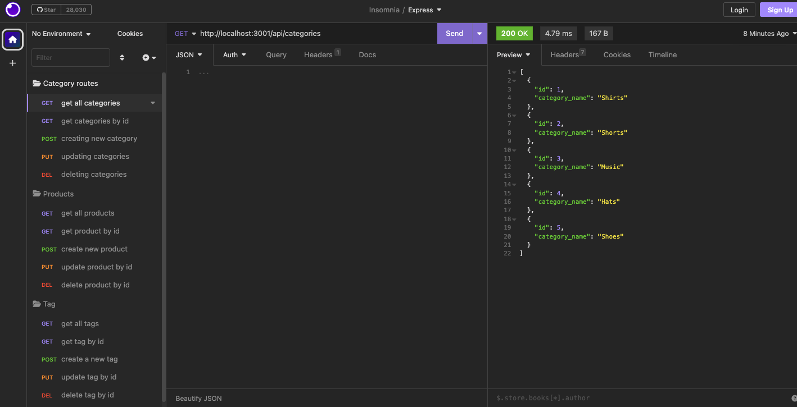

# Retail-Me-Please

## Description
Given starter code, I configured an Express.js API to use Sequelize to interact with a MySQL e-commerce database. The bulk of the work was spent creating models, establishing model relationships, and writing API routes to create, read, update, and delete products, categories, and tags.

This project was the first time I was creating models with multiple relationships, writing API routes, and extensively testing routes in Insomnia. I learned the importance of testing each route before moving on to writing the next one. I also learned how to organize route requests in Insomnia to easily test endpoints. I hadn't had much practice using CRUD methods before, and I now feel more comfortable using them to alter database information. 

Link to video demo: https://drive.google.com/file/d/1qg3_U2PF7Y4USK-uVZOYZlzHbnLXd_5g/view?usp=sharing

## Installation
1. Copy the SSH key in my GitHub repo and paste `git clone <SSHKEY>` in your terminal to create a local copy on your computer\
OR
2. Download the zip file and manually copy the files to your computer
3. Install node by copying and pasting the code `npm init -y` in your terminal
4. Run `npm i` to install the necessary applications 

## Usage
1. Open the index.js file in your terminal\
*Note: Make sure you have the starter code copied first!
2. Create a .env file with the following information, using your MySQL password:\
`DB_NAME='ecommerce_db'
DB_USER='root'
DB_PW='YOURPASSWORD'`
3. Run `npm run seed` to seed the files
4. Run `npm run start` to connect to the server
5. Open Insomnia and test each route 

## Credits 
I used Express, MySQL, Sequelize, and Insomnia for this project.

- [Sequelize Validations](https://sequelize.org/docs/v6/core-concepts/validations-and-constraints/)
- [Sequelize many-to-many-relationships](https://sequelize.org/docs/v6/core-concepts/assocs/#many-to-many-relationships)
- [Sequelize advanced-many](https://sequelize.org/docs/v6/advanced-association-concepts/advanced-many-to-many/)

## License
MIT License
